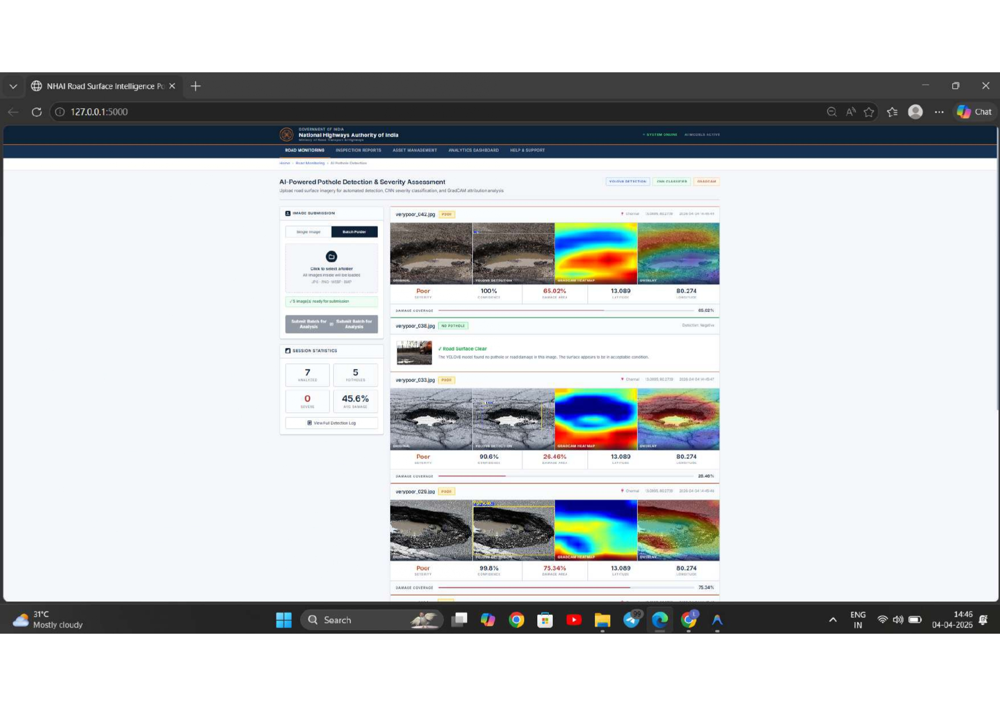
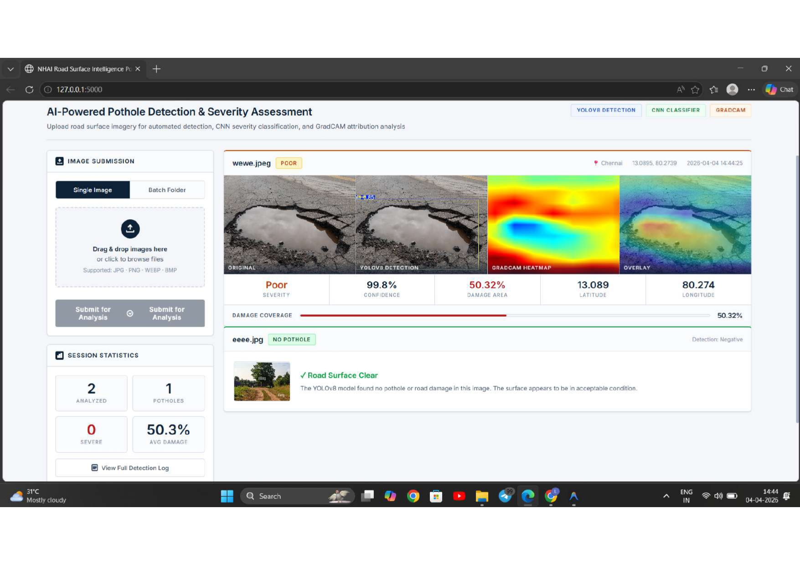

# 🚧 AI-Based Road Damage Detection System

AI-based system for detecting and classifying road damages using YOLO, CNN, and Explainable AI (Grad-CAM)

---

## 🖼️ Sample Outputs

### 🔹 Detection Output


### 🔹 Heatmap Visualization


### 🔹 Web Interface


---

## 📁 More Outputs
👉 [View all outputs](screenshots/)

---

## ⚙️ Tech Stack
- Python
- YOLO (Object Detection)
- CNN (Classification)
- OpenCV
- TensorFlow/Keras
- Flask

---

## 🚀 Features
- Real-time pothole detection  
- Severity classification (Low / Medium / High)  
- Explainable AI with Grad-CAM  
- Batch and single image processing  
- Web-based interface  

---

## 📊 Results
- Detection Accuracy: **91.5%**  
- Classification Accuracy: **93.2%**

---

## 🔧 How to Run
```bash
pip install -r requirements.txt
python app.py
